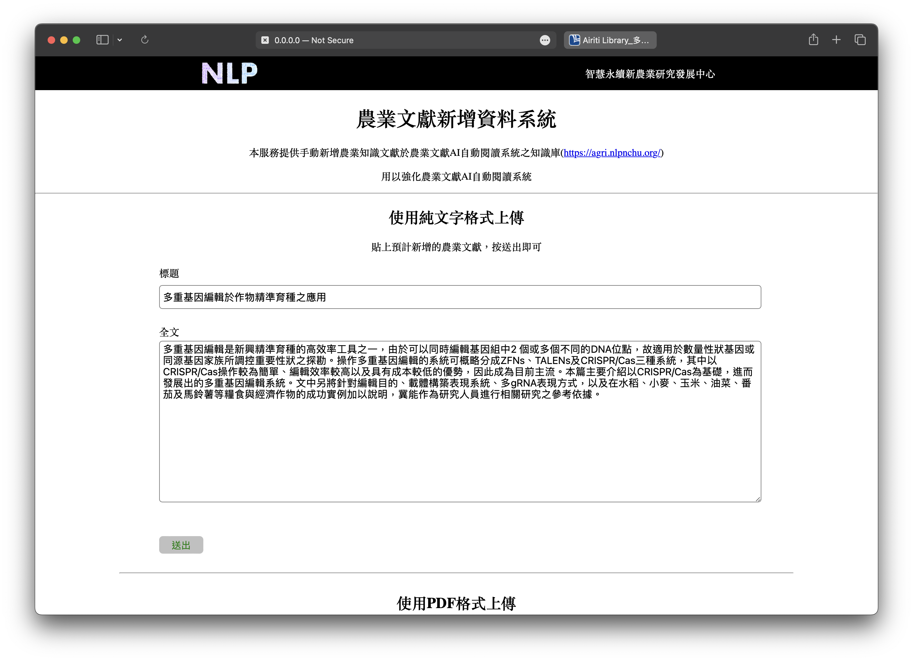
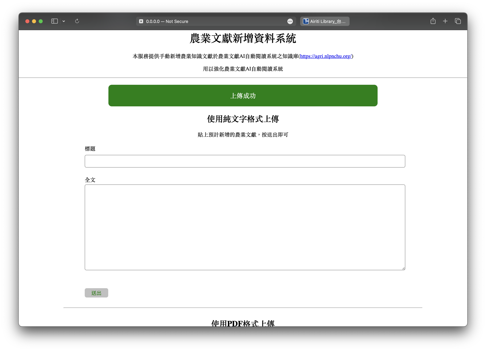
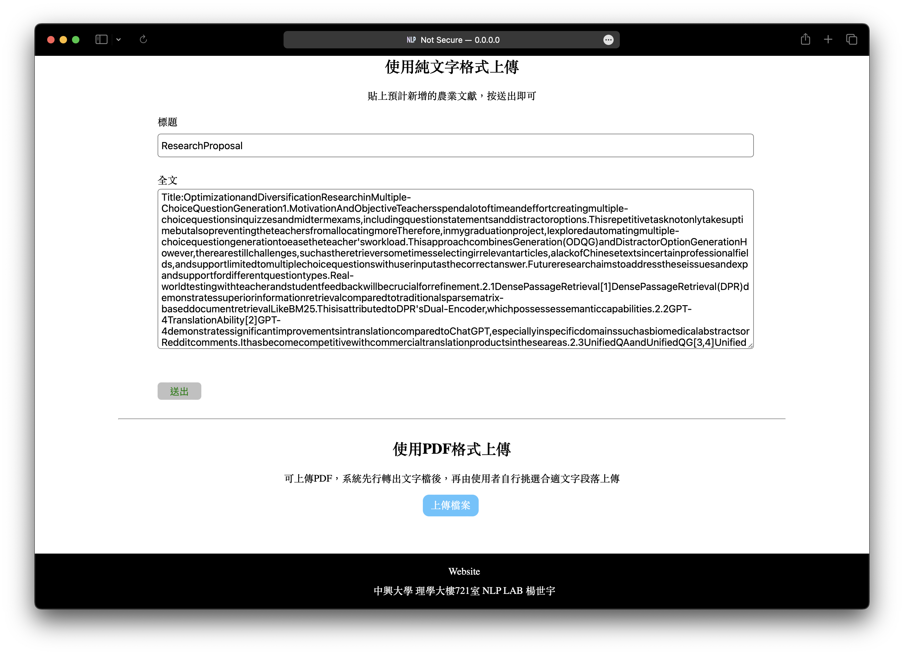

# 農業文獻蒐集系統網站

## 介紹

- 用來搜集農業文獻，用來使用於農業文獻相關機器學習的資料
- 使用者可以透過輸入文字或上傳PDF兩種方法

## 方法一：輸入文字上傳

1. 輸入標題及內文
2. 點選送出鍵

## 方法二：選擇PDF上傳

1. 點選上傳檔案
2. 選擇檔案
3. 確認文字無誤後，按送出鍵

## 技術

### 前端

Html、CSS、JavaScript、JQuery

### 後端

FastAPI

### PDF轉換

Pymupdf